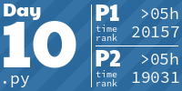
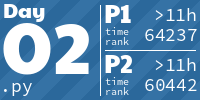
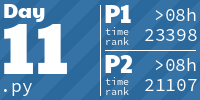
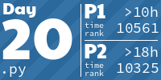
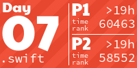
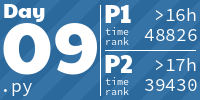
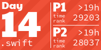

<h1 align="center">
    Advent of Code Solutions
</h1>

---

The graphic below has been created with [aoc-tiles](.pre-commit-config.yaml) script by [LiquidFun](https://github.com/LiquidFun).

---

<!-- AOC TILES BEGIN -->
<h1 align="center">
  Advent of Code - 95/470 ⭐
</h1>
<h1 align="center">
  2024 - 18 ⭐ - Python
</h1>

<h1 align="center">
  2023 - 43 ⭐ - Python
</h1>

<h1 align="center">
  2022 - 34 ⭐ - 
</h1>

<!-- AOC TILES END -->
